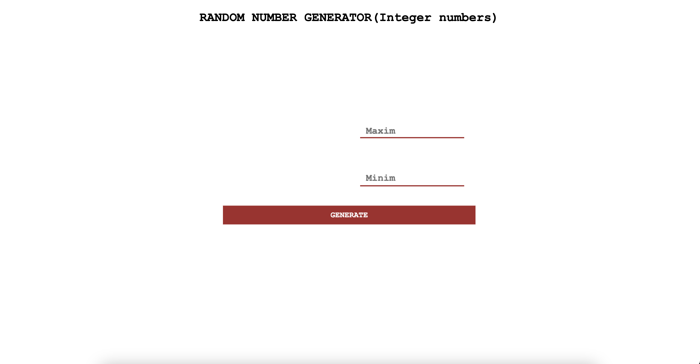
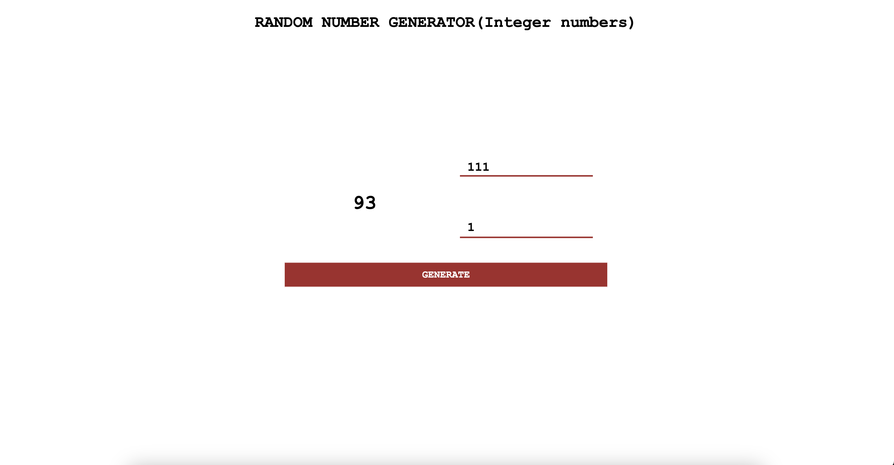

# 🎲 Random Number Generator 🎲

Welcome to the Random Number Generator! 🚀 This simple tool allows you to generate random numbers within a specified range. It's perfect for games, raffles, or any situation where you need a random number!

## How to Use

1. Set the range of numbers within which you want to generate random numbers (e.g., from 1 to 100).
2. Click the "Generate" button to get a random number within the specified range.
3. The tool will display the random number in the designated area.
4. Use the generator for any purpose you need – drawing winners, making decisions, or just having fun!

## Try the Live Demo

Check out the live demo of the Random Number Generator [here](https://morohoschidanieli.github.io/random-number/). 🌐

## Screenshots

## Technologies Used

The Random Number Generator is built using the following technologies:

- HTML, CSS, and JavaScript: For creating the user interface and generator logic.
